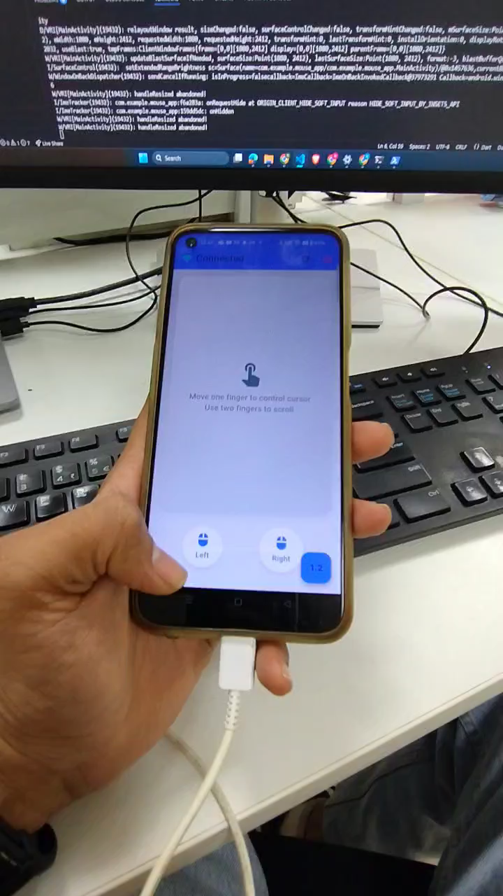

# Phone Mouse (Flutter + WebSocket)

A Flutter app that turns your Android phone into a wireless touchpad and mouse for your PC over Wi-Fi using WebSocket. Move the cursor, click, and scroll in real-time.  

---

## Demo Video

[](demo/demo.mp4)

---

## Features

- Smooth cursor movement with adjustable sensitivity.
- Single-finger touch for mouse movement.
- Two-finger touch for vertical scrolling.
- Tap, double-tap, and long-press for left-click actions.
- Left and right buttons at the bottom for quick clicks.
- Minimal and modern UI design.
- Connect once using Windows IP and Port at startup.

---


**Startup Screen**  
Enter your PC IP and Port to connect.

**Touchpad Screen**  
Control the cursor, scroll, and click with gestures.

---

## Requirements

- Flutter SDK 
- Android device (phone)
- Windows PC
- Python 3.9+ (for the server)
- Required Python packages:
  - `fastapi`
  - `uvicorn`
  - `pyautogui`

---

## Installation

### 1. Clone the repo
```bash
git clone https://github.com/nikhar-tale/phone-mouse-flutter.git
cd phone-mouse-flutter
```

### 2. Install Flutter dependencies
```bash
flutter pub get
```

### 3. Run the app on your Android device
```bash
flutter run
```

---

## Python Server Setup

### Install Python packages
```bash
pip install fastapi uvicorn pyautogui
```

### Run the server
```bash
python server.py
```

This starts the WebSocket server on port 8000 (default). Make sure your phone and PC are on the same Wi-Fi network.

---

## Usage

1. Open the Flutter app on your Android device.  
2. Enter the Windows PC IP and Port on the startup screen, then tap **Connect**.  
3. Use the touchpad screen:
   - Single finger: move cursor  
   - Two fingers: vertical scroll  
   - Tap: left-click  
   - Double tap: double-click  
   - Long press: hold left-click  
   - Bottom buttons: left/right click  

---

## Configuration

- Adjust sensitivity in the touchpad screen if movement feels too slow or fast.  
- Change the WebSocket port in `server.py` if `8000` conflicts with other services.  

---

## Known Issues

- Works best on the same local network (Wi-Fi). Latency may occur over slow networks.  
- Only supports one client at a time in the current prototype.  
- Multi-monitor setups may require adjusting cursor scaling.  

---

## Folder Structure
```
phone-mouse-flutter/
├─ lib/
│  └─ main.dart      # Flutter app
├─ server.py         # Python WebSocket server
├─ pubspec.yaml      # Flutter dependencies
└─ README.md         # This file
```

---

## Author

**Nikhar Tale**
