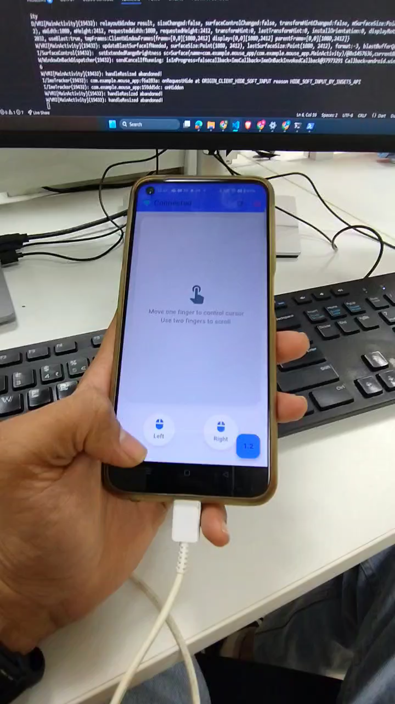

# Phone Mouse (Flutter + WebSocket) - Premium Edition

A premium, modern Flutter application that turns your mobile phone into a wireless trackpad and keyboard controller for your PC over Wi-Fi. 

Move the cursor, trigger complex drag gestures, type text via a built-in virtual keyboard bridge, and automatically discover your PC on the network—all wrapped in a highly responsive, slate-dark glassmorphic UI.

---

## Demo Video

[](demo/demo.mp4)

---

## Features & UI/UX Enhancements

- **Premium Dark Aesthetics**: Styled with a sleek Slate-Dark theme (`Slate 900` background, card containers, glowing Neon Indigo and Teal accents).
- **Auto-Discovery Radar Scanner**: A custom, canvas-painted glowing radar animation that automatically scans the local network via UDP broadcasts to find the PC server, eliminating manual IP inputs.
- **Ergonomic Wireless Keyboard**:
  - Activated by a conveniently located **`KEY`** button positioned directly between the Left and Right click buttons.
  - Custom hidden text field bridge that diffs inputs to capture backspaces, spaces, enters, and alphanumeric text seamlessly.
- **Laptop-Style Click Controls**:
  - Full click-and-hold drag-lock support (hold left click with one thumb while moving the mouse with the other hand).
  - Built-in tactile haptic feedback (`mediumImpact` and `lightImpact`) for all actions.
- **Responsive Dual-Orientation UX**:
  - **Portrait**: Unified settings card and large integrated touchpad panel.
  - **Landscape**: Automatically restructures into a side-by-side console/gamepad layout (70% touchpad on the left, 30% action buttons and connection settings stacked on the right).
- **Ultra-Low Latency Touch Tracking**: Employs a custom cursor ring overlay directly following your touch using reactive `ValueNotifier` bindings, bypassing main widget rebuilds for 60Hz/120Hz tracking.
- **Safe Area & Overflow Handling**: Full support for hardware notches, status bars, rounded device corners, and scrollable startup forms to prevent keyboard layout overflows.

---

## Folder Structure

```
phone-mouse-flutter/
├─ lib/
│  └─ main.dart               # Premium Flutter Touchpad App
├─ pc_server/                 # Standalone PC Receiver Application
│  ├─ server.py               # WebSocket Receiver & UDP Broadcast Responder
│  ├─ requirements.txt        # Python dependency manifest
│  └─ build.ps1               # Automated PyInstaller compiler script (PowerShell)
├─ pubspec.yaml               # Flutter package configuration
└─ README.md                  # Project documentation (this file)
```

---

## Setup & Running the App

Make sure your phone and PC are connected to the **same local Wi-Fi network**.

### 1. Run the PC Server (Receiver)

You have two choices to run the server on your computer:

#### Option A: Standalone Executable (Recommended, Zero Setup)
1. Go to the `pc_server/dist/` directory.
2. Double-click **`phone_mouse_server.exe`** to launch the receiver. A console window will pop up showing startup and connection logs.

#### Option B: Run Python Script (For Developers)
1. Install Python 3.9+ on your computer.
2. Open your terminal in the `pc_server` folder and install dependencies:
   ```bash
   pip install -r requirements.txt
   ```
3. Run the script:
   ```bash
   python server.py
   ```

*Note: If you modify `server.py`, you can compile a fresh executable by running the PowerShell build script `.\pc_server\build.ps1`.*

---

### 2. Run the Flutter Mobile App (Client)

1. Clone this repository to your machine.
2. Install dependencies:
   ```bash
   flutter pub get
   ```
3. Connect your Android or iOS device and run the app:
   ```bash
   flutter run
   ```

---

## Gesture Guide

- **Single Finger Drag**: Move the PC mouse cursor.
- **Double Finger Drag Up/Down**: Scroll vertically.
- **Tap**: Left-click.
- **Double Tap**: Double-click.
- **Long Press**: Hold left-click (drag-lock).
- **Bottom Left/Right Buttons**: Direct mouse clicks (support holding down while dragging).
- **Bottom Center KEY Button**: Toggle the virtual keyboard to type text on your PC.

---

## Session History & Future Roadmap

To review design decisions, past session history, and technical blueprints for future features, check out [brainstorm_and_session_history.md](brainstorm_and_session_history.md).

---

## Author

**Nikhar Tale**
